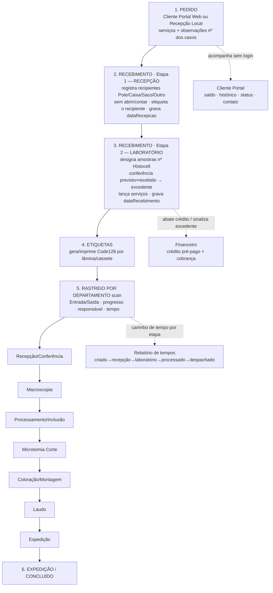

# Fluxo do Processo — Histocell

Passo a passo, do pedido à expedição. (Imagem: `fluxo-processo.svg`.)

## Etapas
1. **Pedido** — cliente (Portal Web, link sem login) ou recepção (local). Serviços + observações (nº dos casos do cliente).
2. **Recebimento · Recepção** — registra o que chegou em recipientes (Pote/Caixa/Saco/Outro), sem abrir nem contar amostras; etiqueta o recipiente. *(dataRecepcao)*
3. **Recebimento · Laboratório** — designa as amostras (nº Histocell), confere previsto×recebido (excedente → cobrança), lança os serviços. *(dataRecebimento)*
4. **Etiquetas** — gera e imprime a etiqueta Code128 por lâmina/cassete (nº impresso = nº do código de barras).
5. **Rastreio por departamento (scan)** — a peça anda escaneando Entrada/Saída em cada setor: Recepção/Conferência → Macroscopia → Processamento/Inclusão → Microtomia → Coloração/Montagem → Laudo → Expedição. Barra de progresso + responsável + tempo por etapa.
6. **Expedição / Concluído** — a saída da Expedição encerra a peça.

**Transversais:** Financeiro (crédito pré-pago abatido no recebimento; excedente sinalizado), Cliente (portal: saldo, histórico, status, contato), Relatório de tempos (carimbos por etapa, a partir dos scans).
